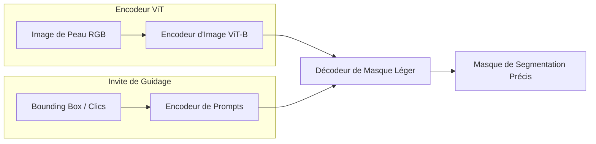

# Note méthodologique : preuve de concept

---

# Dataset retenu

### Présentation générale et contexte médical
Le jeu de données retenu pour cette preuve de concept (POC) est issu du challenge international **ISIC 2018 (International Skin Imaging Collaboration)**, spécifiquement la **Tâche 1 : Lesion Boundary Segmentation** (Segmentation des contours de lésions cutanées). L'ISIC est une initiative académique et industrielle mondiale visant à standardiser et à améliorer l'imagerie dermatologique pour lutter contre la mortalité liée au mélanome grâce à l'apprentissage automatique.

Le dataset se compose d'images de dermoscopie haute résolution représentant diverses pathologies cutanées (mélanomes, nævus, kératoses séborrhéiques, carcinomes). Chaque image est associée à un masque binaire de vérité terrain (Ground Truth). 

### Processus d'annotation et rigueur scientifique
Pour garantir la fiabilité clinique du benchmark, le processus d'annotation suit un protocole strict :
* **Validation multi-experts :** Chaque masque de segmentation de référence a été dessiné manuellement par 5 médecins dermatologues experts.
* **Fusion consensuelle :** Le masque final fourni comme vérité terrain représente le consensus géométrique (fusion et vote majoritaire) de ces 5 tracés d'experts, minimisant ainsi la variabilité inter-observateur inhérente au diagnostic visuel.

### Répartition quantitative des données
Le volume total d'images a été structuré de la manière suivante pour le développement et l'évaluation :
* **Données d'entraînement :** 2 594 couples d'images et masques.
* **Données de validation :** 100 couples d'images et masques.
* **Données de test :** 1 000 couples d'images et masques (utilisés pour le benchmark quantitatif final).

> [!NOTE]
> Le dataset **ISIC 2017** est également supporté par le pipeline pour enrichir le dashboard avec des métadonnées cliniques (notamment le type de lésion). Cependant, cette donnée de catégorisation n'est pas utilisée pour l'analyse de l'importance des caractéristiques (feature importance). Celle-ci repose exclusivement sur des critères géométriques et internes au modèle : la taille des lésions sur les images pour l'analyse globale, et les heatmaps d'attention pour l'analyse locale.


---

# Les concepts de l’algorithme récent

Le nouvel algorithme évalué dans cette étude est **MedSAM (Segment Anything in Medical Images)**, publié au début de l'année 2024. Il s'agit d'une adaptation spécialisée pour le domaine médical du modèle révolutionnaire **SAM (Segment Anything Model)** développé par Meta AI.




### 1. L'architecture "Foundation Model" en Imagerie Médicale
Contrairement aux modèles de segmentation classiques (comme U-Net) qui sont entraînés à partir de zéro sur un type d'image très précis, MedSAM est un **modèle de fondation**. Il a été pré-entraîné sur un ensemble de données gigantesque :
* Plus de **1,4 million d'images médicales**.
* Couverture de **15 modalités d'imagerie** différentes (IRM, Scanner CT, Échographie, Dermoscopie, Radiographie, etc.).
* Segmentation de centaines de cibles anatomiques et pathologiques.

Cette diversité d'apprentissage confère à MedSAM une compréhension géométrique et sémantique universelle des contrastes et des formes médicales.

### 2. Le mécanisme de prompting (Guidage interactif)
L'innovation majeure de MedSAM réside dans son approche interactive. Le modèle ne produit pas une prédiction brute et figée. Il utilise des **invites (prompts)** en entrée pour orienter son attention :
* **Boîtes englobantes (Bounding Boxes) :** L'utilisateur (ou un algorithme de détection) trace un rectangle grossier autour de la lésion. Le modèle encode cette région et extrait les contours exacts à l'intérieur.
* **Points de guidage :** Des clics (positifs pour inclure, négatifs pour exclure) permettent d'ajuster les frontières en temps réel.

Techniquement, l'image est encodée une seule fois par un puissant **Vision Transformer (ViT-B)** pour produire un embedding à haute dimension. L'invite, encodée séparément, est injectée dans un décodeur de masque très léger qui fusionne les informations et génère le contour en quelques millisecondes. Cela permet une interactivité fluide dans des applications cliniques en temps réel.

### 3. Capacité "Zero-Shot"
MedSAM est conçu pour fonctionner en mode **Zero-Shot**. Cela signifie qu'il peut segmenter des objets ou des pathologies qu'il n'a jamais vus lors de sa phase d'entraînement, sans nécessiter de ré-entraînement de ses poids (fine-tuning). Dans notre projet, nous exploitons cette force pour segmenter les lésions cutanées de l'ISIC simplement en lui fournissant des coordonnées de boîte englobante.

---

# La modélisation

La démarche expérimentale vise à comparer le modèle récent (MedSAM) à deux baselines de l'état de l'art historique.

### 1. Définition des modèles comparés
* **Baseline 1 : U-Net standard**
  * Architecture convolutive classique avec encodeur (contraction) et décodeur (expansion) reliés par des connexions par saut (*skip connections*).
  * Entraîné à partir de zéro (*from scratch*) sur les images redimensionnées en 256x256 pixels.
* **Baseline 2 : DeepLabV3+**
  * Modèle convolutif avancé utilisant un backbone **ResNet50** pré-entraîné sur ImageNet.
  * Intègre un module **ASPP (Atrous Spatial Pyramid Pooling)** pour capturer le contexte à plusieurs échelles grâce à des convolutions dilatées.
  * Entraîné avec et sans augmentation de données (*Data Augmentation*) pour stabiliser l'apprentissage.
* **Modèle testé : MedSAM (Zero-Shot)**
  * Exploitation des poids pré-entraînés officiels (`medsam_vit_b.pth`).
  * Inférence guidée par la boîte englobante de la lésion (avec une marge de sécurité de 20 pixels par rapport aux bords réels du masque de test pour simuler une interaction utilisateur réaliste).

### 2. Protocole d'entraînement des baselines
Pour les modèles U-Net et DeepLabV3+, le protocole suivant a été implémenté sous Keras/TensorFlow :
* **Fonction de perte :** *Dice Loss* ($1 - \text{Dice Coefficient}$), particulièrement robuste face au déséquilibre de classes (la peau saine occupant souvent une surface bien plus importante que la lésion).
* **Optimiseur :** Adam avec un taux d'apprentissage initial de $10^{-4}$.
* **Régularisation et Callbacks :**
  * *EarlyStopping :* Arrêt de l'entraînement si la perte de validation ne s'améliore pas après 10 époques (avec restauration des meilleurs poids).
  * *ReduceLROnPlateau :* Division par 2 du taux d'apprentissage si la perte de validation stagne pendant 5 époques.
  * *Batch Normalization :* Appliquée après chaque bloc convolutif pour accélérer la convergence.

### 3. Métriques d'évaluation
La performance des segmentations sur le jeu de test est mesurée à l'aide de deux métriques géométriques de référence :
* **Score Dice (DSC - Dice Similarity Coefficient) :** Mesure la superposition entre le masque réel ($Y$) et le masque prédit ($\hat{Y}$).
  $$\text{Dice}(Y, \hat{Y}) = \frac{2 |Y \cap \hat{Y}|}{|Y| + |\hat{Y}|}$$
* **Indice de Jaccard (IoU - Intersection over Union) :** Calcule le ratio entre l'intersection et l'union des deux masques.
  $$\text{IoU}(Y, \hat{Y}) = \frac{|Y \cap \hat{Y}|}{|Y \cup \hat{Y}|}$$

---

# Une synthèse des résultats

L'évaluation comparative a été menée sur le jeu de test. Elle démontre les gains de performance apportés par le modèle de fondation récent par rapport aux approches supervisées classiques.

### 1. Analyse quantitative globale
Les performances moyennes obtenues sur les 1 000 images de test révèlent une hiérarchie claire :

| Modèle | Variante | Indice IoU Moyen | Score Dice Moyen | Type d'Apprentissage / Entrée |
| :--- | :--- | :---: | :---: | :--- |
| **MedSAM** 🏆 | **Base (Zero-Shot interactif)** | **0.854** | **0.919** | **Zero-Shot interactif (BBox)** |
| DeepLabV3+ | Avec Augmentation de données | 0.8168 | 0.8916 | Supervisé (Pré-entraîné) |
| DeepLabV3+ | Base | 0.7834 | 0.8723 | Supervisé (Pré-entraîné) |
| U-Net | Avec Augmentation de données | 0.7616 | 0.8541 | Supervisé (From scratch) |
| U-Net | Base | 0.7527 | 0.8349 | Supervisé (From scratch) |

* **MedSAM surpasse les baselines :** En exploitant une simple boîte englobante, MedSAM obtient un Dice moyen de **0.919**, soit un gain de **+2.7%** par rapport au meilleur modèle DeepLabV3+ et **+6.5%** par rapport au meilleur modèle U-Net.
* **Robustesse géométrique :** L'IoU de MedSAM (**0.854**) démontre que le modèle épouse fidèlement la forme des lésions, évitant les sous-segmentations fréquentes chez U-Net dans les zones de faible contraste.


### 2. Analyse qualitative
* Les modèles supervisés (U-Net et DeepLabV3+) souffrent de l'hétérogénéité des images de dermoscopie (variations d'éclairage, présence de poils, présence de gel dermatologique). Ils ont tendance à produire des masques fragmentés ou à ignorer les extensions floues des mélanomes.
* MedSAM, grâce à la contrainte spatiale du rectangle et à ses représentations ViT globales, isole parfaitement la lésion d'un seul bloc, même lorsque la transition de couleur avec la peau saine est progressive et ambiguë.

> [!TIP]
> Le gain de performance de MedSAM valide l'approche moderne des modèles de fondation en imagerie médicale : au lieu de collecter et d'annoter des milliers d'images pour entraîner un modèle spécifique, l'utilisation d'un modèle universel guidé par l'utilisateur s'avère plus efficace et immédiatement transférable en clinique.

---

# L’analyse de la feature importance globale et locale du nouveau modèle

L'explicabilité (XAI) de MedSAM a été analysée sous deux angles complémentaires : une approche locale (heatmaps d'attention) et une approche globale (analyse morphologique).

### 1. Analyse locale : Heatmap d'attention du Vision Transformer
Pour comprendre les décisions de MedSAM, un mécanisme de capture (*hook*) a été branché sur le dernier bloc d'attention de son encodeur d'images (`image_encoder.blocks[-1]`). L'étude du cas de l'image **ISIC_0036191** (qui a obtenu un Dice score de **0.60**) a mis en lumière trois phénomènes physiques majeurs :

```
[Attention Sinks] ──> Concentration aberrante sur la peau saine
[Hair Distractor]  ──> Point chaud localisé sur le tracé du cheveu
[Position Grid]    ──> Artefacts géométriques en forme de grille régulière
```

* **Le phénomène des "Attention Sinks" (Puits d'attention) :** L'attention maximale (zones chaudes en rouge) ne se focalise pas sur la lésion mais se disperse sur la peau saine environnante. En effet, dans les architectures ViT, le dernier bloc utilise les zones uniformes (background peu informatif) comme un "espace de stockage de calcul" pour consolider les informations globales de l'image.
* **Le cheveu comme distracteur à fort contraste :** Un cheveu traverse le coin inférieur gauche de l'image. Le dermatologue a exclu ce cheveu de la lésion (créant une encoche dans le masque réel). Cependant, le cheveu crée un fort gradient de contraste local qui a piégé les couches d'attention de MedSAM. Le modèle a segmenté une ellipse parfaite sans l'encoche, et l'attention s'est concentrée sur le point d'entrée du cheveu.
* **Le biais de grille positionnelle (Positional Grid Bias) :** Sur les textures uniformes de la peau saine, on observe trois taches d'attention alignées géométriquement. Cela trahit l'influence des *Positional Embeddings* 2D du transformateur, qui projette sa grille interne de patches lorsque le contenu sémantique local est trop faible.

### 2. Analyse globale : Impact morphologique de la taille de la lésion
En analysant la performance de MedSAM sur l'ensemble du dataset de test en mode "Plein Image" (sans focalisation de boîte serrée), les images ont été séparées en trois catégories de tailles égales via un découpage par quantiles (`pd.qcut`) :

| Catégorie de Taille | Score Dice Moyen | Dispersion (Variance) | Observations géométriques |
| :--- | :---: | :--- | :--- |
| **Petite** | **0.926** | Très faible | Lésions régulières, contours nets et centrés. |
| **Moyenne** | **0.925** | Faible | Excellente stabilité du tracé automatique. |
| **Grande** | **0.905** | Forte | Nombreux outliers (Dice < 0.70, certains < 0.35). |

* **Stabilité sur les petites/moyennes lésions :** MedSAM excelle et se montre extrêmement régulier (boîte à moustaches très serrée entre 0.90 et 0.97).
* **Instabilité sur les grandes lésions :** La performance chute de **2.1%** et la variance augmente fortement. Cela s'explique par :
  1. **La complexité des stades avancés :** Les grandes lésions correspondent souvent à des mélanomes invasifs, asymétriques, présentant des zones de régression (décoloration) et des bordures très floues.
  2. **La troncation aux bords :** Les lésions volumineuses touchent fréquemment les limites physiques de la photographie, perturbant la détection de fin d'objet du modèle.

---

# Les limites et les améliorations possibles

Bien que MedSAM affiche des résultats supérieurs aux baselines convolutives, cette preuve de concept révèle des limites techniques claires qu'il convient de corriger pour une mise en production clinique.

### 1. Limites identifiées
* **Dépendance exclusive aux boîtes englobantes (Bounding Boxes) :** Contrairement à son architecture parente (SAM), MedSAM est optimisé très spécifiquement pour le guidage par boîte. L'utilisation de points de guidage (clics seuls) s'avère inefficace pour segmenter une lésion complexe de manière autonome. Par ailleurs, en cas de boîte trop large (mode Plein Image), le modèle perd en précision et est sujet aux distracteurs périphériques.
* **Sensibilité aux artefacts de surface (Cheveux) :** Les cheveux et les poils sur la peau perturbent l'attention du modèle et faussent la délimitation fine des contours de la lésion.
* **Instabilité sur les formes complexes/grandes :** Les lésions asymétriques ou étalées génèrent des scores aberrants (outliers sous les 0.50 de Dice).

### 2. Améliorations envisagées

1. **Intégration d'un pré-traitement de retrait des cheveux (DullRazor) :**
   L'application systématique de l'algorithme DullRazor (qui détecte les cheveux par morphologie mathématique et les remplace par interpolation bilinéaire des pixels sains voisins) permettrait de lisser l'image avant l'inférence. Cela éliminerait les points chauds d'attention parasites et remonterait le score Dice sur les images bruitées.
2. **Double Prompting (BBox + Points) :**
   Dans l'interface utilisateur, permettre au médecin de tracer la boîte englobante, puis d'ajouter 1 ou 2 clics correcteurs (par exemple, un clic négatif sur une zone de peau saine incluse par erreur, ou un clic positif sur une bordure floue omise). Le décodeur de MedSAM recalculera le masque en 10 ms en combinant les deux types de prompts, éliminant ainsi les erreurs sur les lésions complexes.
3. **Indicateur de confiance dynamique dans le Dashboard :**
   Pour rendre l'outil d'aide au diagnostic plus sûr pour les cliniciens :
   * Si l'utilisateur dessine une boîte englobante de grande taille (dépassant un certain seuil de pixels), le dashboard Streamlit affiche une alerte visuelle : 
     `⚠️ Lésion volumineuse détectée : la précision du modèle automatique peut être altérée. Veuillez vérifier manuellement les contours ou utiliser des clics de guidage.`
4. **Couplage avec les métadonnées cliniques (ISIC 2017) :**
   Affichage et corrélation visuelle dans le dashboard des variables cliniques (âge, sexe, emplacement anatomique) avec la qualité de la segmentation pour aider le diagnostic médical, sans intégration de ces métadonnées dans le calcul de la feature importance intrinsèque du modèle.
